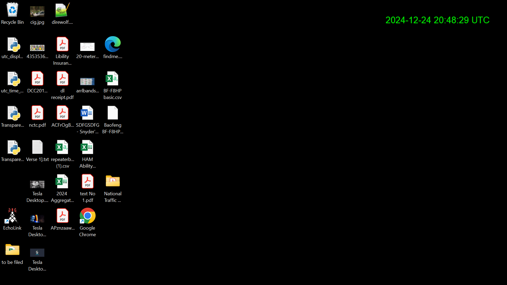

# UTC Time Display Widget

A super lightweight Python script to display the current UTC date and time in a transparent, draggable window on your **Windows desktop**. Designed for simplicity and portability, this tool is perfect for anyone who needs a quick, unobtrusive UTC clock.

---

## Features
- **Real-time UTC updates**: Refreshes every second to ensure accurate time display.
- **Transparent background**: Seamlessly blends into your desktop environment.
- **Draggable window**: Click and drag to position the display anywhere on your screen.
- **Top-right alignment**: Defaults to the top-right corner of your screen with a 10px margin.
- **Windows compatibility**: Designed and tested on Windows 11, but may work on other versions.

---

## Screenshot


---

## Prerequisites
1. **Python 3.x**: Ensure Python is installed on your system. [Download Python](https://www.python.org/downloads/)
2. **tkinter**: Pre-installed with most Python distributions. Verify by running:
   ```bash
   python -m tkinter
   ```
   If not installed, use:
   ```bash
   pip install tk
   ```

---

## Usage
1. **Clone the repository**:
   ```bash
   git clone https://github.com/TemplarPirate/UTC-Time-and-date-widget.git
   ```
2. **Navigate to the directory**:
   ```bash
   cd UTC-Time-and-date-widget
   ```
3. **Run the script**:
   ```bash
   python utc_display_widget.pyw
   ```

---

## Customization
- **Font size and style**: Adjust the `font` parameter in the `label` setup:
  ```python
  font=("Helvetica", 20)
  ```
- **Transparency**: Modify the `-alpha` value (0.0 to 1.0) for desired opacity.
- **Window positioning**: Change `x_position` and `y_position` for different alignments.

---

## Compatibility
This script is designed for Windows environments. While it may work on other operating systems (e.g., Linux or macOS), the transparent background and some UI behaviors are specific to Windows and might not function as expected elsewhere.

---

## Future Development
- Explore compatibility for other operating systems (Linux/macOS).
- Add more customization options, such as themes and additional time zones.

---

## Contribution
Contributions are welcome and strongly encouraged (I'd love upgrade contributions)! If you have suggestions, find issues, or would like to collaborate, feel free to:
- Submit a pull request.
- Open an issue.

---

## License
This project is licensed under the [MIT License](LICENSE). You are free to use, modify, and distribute this software as long as proper attribution is given.


**If you like this project, please ⭐ it to show your support!**

## Support Me:
If you find these bookmarks helpful and want to support my work, feel free to [buy me a coffee](https://buymeacoffee.com/scofflaw)! ☕

